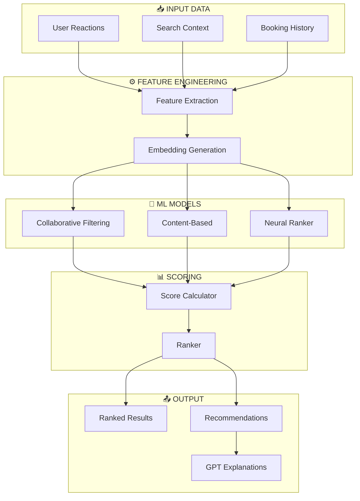

# 🤖 AI Matching Service – Complete Documentation

> Detailed description of the AI layer for hotel search personalization.

---

## AI Layer Architecture



---

## 1. Data Collection

### 1.1 User Reactions

| Event | Weight | Description |
|-------|--------|-------------|
| `VIEW` | 0.1 | View hotel card (>2 sec) |
| `CLICK` | 0.3 | Click on hotel details |
| `LIKE` ❤️ | 0.7 | Explicit Like |
| `DISLIKE` 👎 | -0.8 | Explicit Dislike |
| `BOOK` | 1.0 | Successful Booking |
| `CANCEL` | -0.5 | Booking Cancellation |

```typescript
interface ReactionEvent {
  userId: string;
  hotelId: string;
  type: 'VIEW' | 'CLICK' | 'LIKE' | 'DISLIKE' | 'BOOK' | 'CANCEL';
  timestamp: Date;
  context: {
    searchQuery: SearchParams;
    positionInResults: number;
    deviceType: 'mobile' | 'desktop';
    sessionDuration: number;
  };
}
```

---

## 2. Feature Engineering

### 2.1 Core User Metrics

#### Price Sensitivity Score (PSS)
`PSS = avg(booked_prices) / avg(viewed_prices)`

- **PSS < 0.7**: Discount Hunter
- **PSS 0.7-1.0**: Balanced
- **PSS > 1.0**: Premium Buyer

#### Rating Preference (RP)
`RP = Σ(liked_rating × weight) / Σ(weight)`
*where weight = recency_factor × reaction_strength*

---

## 3. ML Models

### 3.1 Neural Ranker Implementation

The Neural Ranker uses a **Two-Tower Model** architecture, trained to predict the probability of a click/booking given a user-hotel pair.

#### Training Pipeline (Python/PyTorch)
```python
class TwoTowerModel(nn.Module):
    def __init__(self):
        super().__init__()
        self.user_tower = nn.Sequential(
            nn.Linear(128, 256),
            nn.ReLU(),
            nn.Dropout(0.3),
            nn.Linear(256, 128),
            nn.ReLU(),
            nn.Linear(128, 64),
        )
        self.hotel_tower = nn.Sequential(
            nn.Linear(256, 256),
            nn.ReLU(),
            nn.Dropout(0.3),
            nn.Linear(256, 128),
            nn.ReLU(),
            nn.Linear(128, 64),
        )
    
    def forward(self, user_features, hotel_features):
        user_emb = F.normalize(self.user_tower(user_features), dim=1)
        hotel_emb = F.normalize(self.hotel_tower(hotel_features), dim=1)
        score = torch.sum(user_emb * hotel_emb, dim=1)
        return torch.sigmoid(score)
```

#### Production Inference (Node.js/ONNX)
For high-performance low-latency ranking, the model is exported to ONNX and run directly in the Node.js backend.

```typescript
// src/services/ai/neural-ranker.ts
import * as ort from 'onnxruntime-node';

export class NeuralRanker {
  private session: ort.InferenceSession;

  async init() {
    this.session = await ort.InferenceSession.create('model.onnx');
  }

  async rank(userFeatures: number[], hotelResults: Hotel[]): Promise<number[]> {
    // Generate scores for all hotels in batch
    const feeds = {
      'user_tower_input': new ort.Tensor('float32', userFeatures),
      'hotel_tower_input': new ort.Tensor('float32', flattenHotelFeatures(hotelResults))
    };
    const results = await this.session.run(feeds);
    return results.output.data as number[];
  }
}
```

---

## 4. Cold Start Solutions

### 4.1 New User (Zero Identity)
When a user has no history, we fall back to a **Meta-Cluster Strategy**:
1. **Geographic Clustering**: Match with users from the same city/region.
2. **Contextual Defaults**: Predict intent based on current daytime (e.g., late night search = urgency/business).
3. **Similarity Sampling**: Use Collaborative Filtering on "anonymous cohort" patterns.

### 4.2 New Hotel
Use **Content-Based Embedding Injection**:
1. Generate an embedding based purely on hotel metadata (Price, Star, Amenities).
2. Find the top 10 most similar established hotels.
3. Assign the new hotel a "Shadow Weight" based on the average collaborative score of its neighbors.

---

## 5. GPT Chatbot Integration

The chatbot acts as a **Natural Language Filter Processor**.

### Function Calling Flow
1. **Intent Extraction**: GPT extracts `location`, `dates`, `guests`, `style`.
2. **Preference Injection**: The backend injects the user's `UserPreferenceProfile` into the search parameters.
3. **Conversational Scoping**: GPT explains *why* it chose certain hotels (e.g., "I found these based on your preference for quiet locations near the beach").
