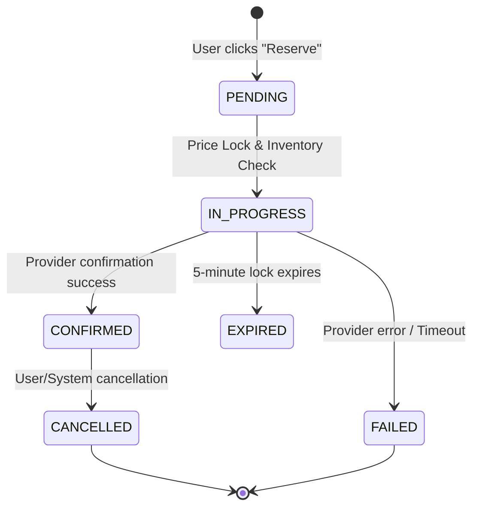

# 🔄 Booking State Machine & Transaction Logic

> Detailed logic for handling bookings from initialization to final provider confirmation, ensuring zero data loss and handling partial failures.

---

## 1. State Machine (Status Transitions)



---

## 2. The "Price Lock" Pattern

To avoid price changes during the checkout flow (a common issue in travel), we implement a **5-minute Redis-based Lock**.

1.  **Check**: Query Pricing Service for fresh price.
2.  **Store**: Save `hotelId:price:expiry` in Redis.
3.  **Token**: Return a signed JWT to the client containing this price.
4.  **Validate**: On `confirm`, the backend checks if the lock is still valid and the price matches the signed token.

---

## 3. Atomic Transaction Logic

When a booking is confirmed, we must perform an atomic operation:

```typescript
// Pseudo-code for Booking Confirmation
async function confirmBooking(token: string) {
  const data = verifyToken(token);
  
  return await prisma.$transaction(async (tx) => {
    // 1. Create local booking record (Status: IN_PROGRESS)
    const booking = await tx.booking.create({ data: { ... } });
    
    // 2. Call Provider Adapter (External Network Call)
    const externalResult = await adapter.createBooking(data);
    
    if (externalResult.success) {
      // 3. Update status to CONFIRMED
      return await tx.booking.update({
        where: { id: booking.id },
        data: { status: 'CONFIRMED', confirmationId: externalResult.id }
      });
    } else {
      throw new ProviderError(externalResult.message);
    }
  });
}
```

---

## 4. Handling Integration Failures

- **Network Timeout during `createBooking`**: The transaction is rolled back, but we must verify with the provider via `getBookingStatus` if the booking was actually created before retrying.
- **Provider Refusal**: Immediately release the price lock and notify the user.
