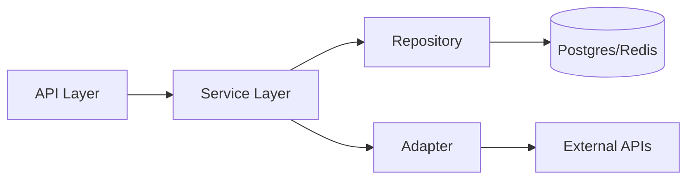

# 📖 Code Patterns Dictionary

> Standardized software architecture patterns and coding conventions for WinWin Travel.

---

## 1. The Service-Repository-Adapter Pattern

We strictly separate concerns into four layers:

1.  **Transport/API**: Handlers (Fastify/Next.js) that manage HTTP/WS connections.
2.  **Service (Business Logic)**: The "brain" of the operation. Orchestrates multiple repositories and external integration services.
3.  **Repository (Data Access)**: Direct interaction with Prisma/Postgres or Redis.
4.  **Adapter (External Integration)**: Maps third-party APIs (Hotelbeds, OpenAI) to our internal domain models.



---

## 2. DTOs and Data Normalization

Never pass "raw" database models or provider responses directly to the frontend.

- **DTO (Data Transfer Object)**: Define clear interfaces for API responses.
- **Normalizer**: Each adapter MUST have a `normalize()` method that maps external JSON to a clean internal DTO.

---

## 3. Error Handling Hierarchy

| Error Category | Pattern | Action |
|----------------|---------|--------|
| **Domain Error** | `DomainError` class | Return specific 4xx with user-friendly message. |
| **Provider Error**| `IntegrationError` | Log detail, return "Partial Results" or 503. |
| **System Error** | `Error` | Catch in global interceptor, report to Sentry. |

---

## 4. Inversion of Control (IoC)

Use Dependency Injection (DI) to make services testable. Pass adapters and repositories into service constructors.

```typescript
class SearchOrchestrator {
  constructor(
    private adapters: IntegrationAdapter[],
    private cache: RedisRepository
  ) {}
}
```

---

## 5. Async Patterns

- **Parallel Execution**: Use `Promise.allSettled` for provider fan-out.
- **Race conditions**: Use Prisma's `$transaction` for booking-related state changes.
- **Stale Data**: Use the "Stale-While-Revalidate" pattern in the Pricing service.
