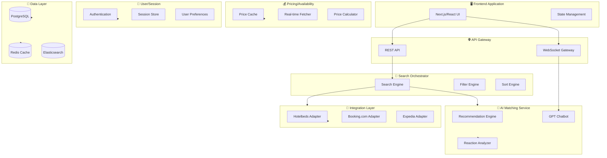
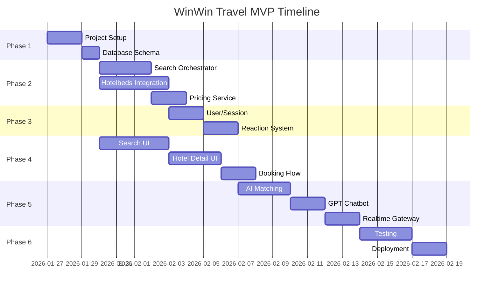

# WinWin Travel MVP Implementation Plan

> **Goal:** Build a production-ready hotel search and booking platform MVP based on the WinWin Travel demo architecture with 6 core layers.


---

## Executive Summary

This plan outlines the implementation of a hotel search/booking MVP with:
- **Smart aggregation** from multiple hotel providers (starting with Hotelbeds)
- **AI-powered personalization** through user reactions and preferences
- **Real-time availability** with dynamic pricing
- **Modern UX** matching the demo's premium design patterns

---

## Architecture Overview



---

## Technology Stack

| Layer | Technology | Rationale |
|-------|------------|-----------|
| **Frontend** | Next.js 14 + TypeScript | SSR, App Router, excellent DX |
| **Styling** | Tailwind CSS + Framer Motion | Rapid premium UI development |
| **State** | Zustand + TanStack Query | Lightweight, optimized data fetching |
| **Backend** | Node.js + Fastify | High performance, TypeScript native |
| **Database** | PostgreSQL + Prisma | Robust relational data, type-safe ORM |
| **Cache** | Redis | Session, price cache, rate limiting |
| **Search** | Elasticsearch | Full-text search, geo-queries |
| **AI** | OpenAI GPT-4 + Embeddings | Chatbot, semantic matching |
| **Auth** | NextAuth.js | OAuth (Google, Facebook, Apple) |
| **Realtime** | Socket.io | WebSocket-based notifications |
| **Queue** | BullMQ | Background job processing |

---

## User Review Required

> [!IMPORTANT]
> **Integration API Keys:** You will need to obtain API credentials for:
> - Hotelbeds (primary provider for MVP)
> - OpenAI (for GPT chatbot and AI matching)
> - OAuth providers (Google, Facebook, Apple)

> [!WARNING]
> **Scope Decision:** This MVP focuses on search and booking flow only. The following are **deferred**:
> - Multi-language support
> - Admin dashboard
> - Loyalty/rewards system

---

## Proposed Changes

### 1. Search Orchestrator

The brain of the search system - coordinates requests, aggregates results, applies filters.

---

#### [NEW] [search-orchestrator.ts](file:///e:/evidenceWWT/src/services/search/search-orchestrator.ts)

```typescript
interface SearchRequest {
  location: {
    latitude: number;
    longitude: number;
    radius: number; // km
    address?: string;
  };
  stay: {
    checkIn: Date;
    checkOut: Date;
  };
  guests: {
    adults: number;
    children?: number[];
    rooms: number;
  };
  filters?: SearchFilters;
  pagination: {
    limit: number;
    offset: number;
  };
  sort?: SortOption;
  integrations: string[];
}

interface SearchFilters {
  priceRange?: { min: number; max: number };
  reviewScore?: { min: number };
  starRating?: number[];
  amenities?: string[];
  freeCancellation?: boolean;
  mealPlan?: string[];
  hideDisliked?: boolean;
}

// Orchestrator responsibilities:
// 1. Parse and validate search request
// 2. Fan-out to integration adapters in parallel
// 3. Normalize and merge results
// 4. Apply post-filters (user reactions)
// 5. Calculate personalized rankings
// 6. Return paginated results
```

---

#### [NEW] [filter-engine.ts](file:///e:/evidenceWWT/src/services/search/filter-engine.ts)

Implements all filtering logic based on demo analysis:
- Price range (€0 - €1000+ slider)
- Review score (0-10)
- Star rating (1-5)
- Quick filters: Free cancellation, Breakfast, Pets allowed
- User reaction filters: Hide liked/disliked offers

---

#### [NEW] [sort-engine.ts](file:///e:/evidenceWWT/src/services/search/sort-engine.ts)

Sorting options observed in demo:
- Price (lowest/highest first)
- Rating (highest first)
- Distance from center
- Relevance (AI-enhanced)

---

### 2. Integration Layer

Abstraction layer for hotel provider APIs with unified data contracts.

---

#### [NEW] [integration-adapter.interface.ts](file:///e:/evidenceWWT/src/integrations/integration-adapter.interface.ts)

```typescript
interface IntegrationAdapter {
  name: string;
  
  search(request: NormalizedSearchRequest): Promise<HotelOffer[]>;
  getHotelDetails(hotelId: string): Promise<HotelDetails>;
  getRoomDetails(hotelId: string, roomId: string): Promise<RoomDetails>;
  checkAvailability(hotelId: string, roomId: string, dates: DateRange): Promise<AvailabilityResult>;
  createBooking(bookingRequest: BookingRequest): Promise<BookingConfirmation>;
}

interface HotelOffer {
  integrationName: string;
  hotelId: string;
  roomId: string;
  name: string;
  starRating: number;
  reviewScore: number;
  location: GeoLocation;
  address: string;
  images: string[];
  roomType: string;
  pricePerNight: number;
  totalPrice: number;
  currency: string;
  amenities: string[];
  mealPlan: string;
  cancellationPolicy: CancellationPolicy;
  availableRooms: number;
}
```

---

#### [NEW] [hotelbeds-adapter.ts](file:///e:/evidenceWWT/src/integrations/hotelbeds/hotelbeds-adapter.ts)

Primary integration adapter for MVP:
- Authentication with Hotelbeds API
- Request/response mapping
- Error handling and retries
- Rate limiting compliance

---

### 3. AI Matching Service

Personalization engine powered by user reactions and preferences.

---

#### [NEW] [ai-matching-service.ts](file:///e:/evidenceWWT/src/services/ai/ai-matching-service.ts)

```typescript
interface AIMatchingService {
  // Analyze user reaction patterns
  analyzeReactions(userId: string): Promise<UserPreferenceProfile>;
  
  // Rank hotels based on user profile
  personalizeResults(
    offers: HotelOffer[],
    userProfile: UserPreferenceProfile
  ): Promise<RankedHotelOffer[]>;
  
  // Generate AI recommendations
  getRecommendations(
    userId: string,
    searchContext: SearchRequest
  ): Promise<HotelOffer[]>;
}

interface UserPreferenceProfile {
  preferredPriceRange: { min: number; max: number };
  preferredStarRating: number;
  preferredAmenities: string[];
  preferredLocationType: 'city-center' | 'quiet' | 'near-attractions';
  avoidPatterns: string[]; // Learned from dislikes
}
```

---

#### [NEW] [reaction-system.ts](file:///e:/evidenceWWT/src/services/ai/reaction-system.ts)

Like/Dislike system observed in demo:
- Store reactions per user+hotel
- Aggregate reaction patterns
- Feed into AI matching
- Support "hide reacted" filter

---

#### [NEW] [gpt-chatbot.ts](file:///e:/evidenceWWT/src/services/ai/gpt-chatbot.ts)

AI assistant for natural language queries:
- "Find me a romantic hotel with sea view under €200"
- "What's the cancellation policy?"
- "Show me pet-friendly options"

---

### 4. Pricing / Availability

Real-time pricing with intelligent caching.

---

#### [NEW] [pricing-service.ts](file:///e:/evidenceWWT/src/services/pricing/pricing-service.ts)

```typescript
interface PricingService {
  // Get cached or fresh prices
  getPrices(hotelIds: string[], dates: DateRange): Promise<PriceResult[]>;
  
  // Real-time availability check
  checkAvailability(hotelId: string, roomId: string, dates: DateRange): Promise<AvailabilityResult>;
  
  // Price breakdown for booking
  calculateTotal(
    roomPrice: number,
    nights: number,
    rooms: number,
    taxes?: TaxInfo
  ): PriceBreakdown;

  // Transaction initialization
  initBooking(params: BookingInitRequest): Promise<BookingToken>;
}

interface PriceBreakdown {
  pricePerNight: number;
  nights: number;
  subtotal: number;
  taxes: number;
  fees: number;
  total: number;
  currency: string;
}
```

---

#### [NEW] [price-cache.ts](file:///e:/evidenceWWT/src/services/pricing/price-cache.ts)

Redis-based price caching:
- TTL: 5-15 minutes depending on demand
- Stale-while-revalidate pattern
- Background refresh for popular searches

---

### 5. User / Session

Authentication and personalization data management.

---

#### [NEW] [auth.config.ts](file:///e:/evidenceWWT/src/lib/auth.config.ts)

NextAuth.js configuration:
- Google OAuth
- Facebook OAuth
- Apple Sign-in
- Email magic link (optional)

---

#### [NEW] [session-service.ts](file:///e:/evidenceWWT/src/services/user/session-service.ts)

- Anonymous session tracking (for reactions before login)
- Session merge on authentication
- Recent searches history
- Compare list management

---

#### [NEW] [user-preferences.ts](file:///e:/evidenceWWT/src/services/user/user-preferences.ts)

- Stored preferences (default guests, currency)
- Notification settings
- Saved hotels/favorites

---

### 6. Realtime Gateway

WebSocket-based real-time features.

---

#### [NEW] [realtime-gateway.ts](file:///e:/evidenceWWT/src/services/realtime/realtime-gateway.ts)

```typescript
interface RealtimeEvents {
  // Price changes for viewed hotels
  'price:update': { hotelId: string; newPrice: number };
  
  // Availability changes
  'availability:update': { hotelId: string; roomsLeft: number };
  
  // Chat messages
  'chat:message': { role: 'user' | 'assistant'; content: string };
  
  // Search progress
  'search:progress': { integrationName: string; status: 'loading' | 'done' };
}
```

---

### 7. Frontend Application

Modern React application with premium UX.

---

#### [NEW] [page.tsx (Search)](file:///e:/evidenceWWT/src/app/page.tsx)

Main search page with:
- Sticky search bar (location, dates, guests)
- Quick filter chips
- Advanced filters modal
- List/Map view toggle

---

#### [NEW] [hotel-card.tsx](file:///e:/evidenceWWT/src/components/hotel-card.tsx)

Hotel result card featuring:
- Image carousel
- Room type, dates, hotel name
- Star rating and review score
- Location with map link
- Like/Dislike buttons
- Total price display


---

#### [NEW] [hotel-detail-page.tsx](file:///e:/evidenceWWT/src/app/hotel/[id]/page.tsx)

Detailed hotel view with tabs:
- **Room**: Images, description, amenities
- **Lodge**: Hotel info, facilities
- **Location**: Map, nearby attractions
- **Other rooms**: Alternative room types
- **Reviews**: Guest reviews
- **Policies**: Cancellation, check-in/out


---

#### [NEW] [booking-sidebar.tsx](file:///e:/evidenceWWT/src/components/booking-sidebar.tsx)

Persistent booking widget:
- Price breakdown (€X × N nights)
- Room quantity selector
- "Request discount" link
- Reserve button

---

#### [NEW] [filters-modal.tsx](file:///e:/evidenceWWT/src/components/filters-modal.tsx)

Advanced filtering modal:
- Price range slider
- Review score slider
- Property rating selector
- Amenities checkboxes
- Search settings (hide reactions)


---

#### [NEW] [auth-modal.tsx](file:///e:/evidenceWWT/src/components/auth-modal.tsx)

Sign-in/Register modal:
- Social login buttons
- Email/password fallback
- Terms acceptance


---

### 8. Database Schema

---

#### [NEW] [schema.prisma](file:///e:/evidenceWWT/prisma/schema.prisma)

```prisma
model User {
  id            String    @id @default(cuid())
  email         String?   @unique
  name          String?
  image         String?
  accounts      Account[]
  sessions      Session[]
  reactions     Reaction[]
  bookings      Booking[]
  preferences   UserPreferences?
  createdAt     DateTime  @default(now())
}

model Reaction {
  id          String   @id @default(cuid())
  userId      String
  hotelId     String
  roomId      String?
  integration String
  type        ReactionType
  createdAt   DateTime @default(now())
  
  user        User     @relation(fields: [userId], references: [id])
  
  @@unique([userId, hotelId, integration])
}

enum ReactionType {
  LIKE
  DISLIKE
}

model SearchHistory {
  id          String   @id @default(cuid())
  userId      String?
  sessionId   String
  query       Json
  resultsCount Int
  createdAt   DateTime @default(now())
}

model Booking {
  id              String   @id @default(cuid())
  userId          String
  hotelId         String
  roomId          String
  integration     String
  checkIn         DateTime
  checkOut        DateTime
  guests          Int
  rooms           Int
  totalPrice      Decimal
  currency        String
  status          BookingStatus
  confirmationId  String?
  createdAt       DateTime @default(now())
  
  user            User     @relation(fields: [userId], references: [id])
}

enum BookingStatus {
  PENDING
  CONFIRMED
  CANCELLED
  COMPLETED
}

model UserPreferences {
  id              String   @id @default(cuid())
  userId          String   @unique
  defaultCurrency String   @default("EUR")
  defaultAdults   Int      @default(2)
  notifications   Boolean  @default(true)
  
  user            User     @relation(fields: [userId], references: [id])
}
```

---

## Project Structure

```
e:/evidenceWWT/
├── src/
│   ├── app/                          # Next.js App Router
│   │   ├── page.tsx                  # Search page
│   │   ├── hotel/[id]/page.tsx       # Hotel detail
│   │   ├── booking/[id]/page.tsx     # Booking confirmation
│   │   ├── api/                      # API routes
│   │   │   ├── search/route.ts
│   │   │   ├── hotels/[id]/route.ts
│   │   │   ├── reactions/route.ts
│   │   │   ├── bookings/route.ts
│   │   │   └── chat/route.ts
│   │   └── layout.tsx
│   │
│   ├── components/                    # React components
│   │   ├── ui/                       # Base UI components
│   │   ├── search/                   # Search-related
│   │   ├── hotel/                    # Hotel display
│   │   └── booking/                  # Booking flow
│   │
│   ├── services/                      # Business logic
│   │   ├── search/
│   │   │   ├── search-orchestrator.ts
│   │   │   ├── filter-engine.ts
│   │   │   └── sort-engine.ts
│   │   ├── ai/
│   │   │   ├── ai-matching-service.ts
│   │   │   ├── reaction-system.ts
│   │   │   └── gpt-chatbot.ts
│   │   ├── pricing/
│   │   │   ├── pricing-service.ts
│   │   │   └── price-cache.ts
│   │   ├── user/
│   │   │   ├── session-service.ts
│   │   │   └── user-preferences.ts
│   │   └── realtime/
│   │       └── realtime-gateway.ts
│   │
│   ├── integrations/                  # Provider adapters
│   │   ├── integration-adapter.interface.ts
│   │   ├── hotelbeds/
│   │   │   └── hotelbeds-adapter.ts
│   │   └── mock/
│   │       └── mock-adapter.ts
│   │
│   ├── lib/                           # Utilities
│   │   ├── auth.config.ts
│   │   ├── prisma.ts
│   │   ├── redis.ts
│   │   └── utils.ts
│   │
│   └── types/                         # TypeScript types
│       ├── search.ts
│       ├── hotel.ts
│       └── booking.ts
│
├── prisma/
│   └── schema.prisma
│
├── public/
│   └── images/
│
├── tests/
│   ├── unit/
│   └── integration/
│
├── .env.example
├── docker-compose.yml
├── package.json
└── README.md
```

---

## Verification Plan

### Automated Tests

```bash
# Unit tests for services
npm run test:unit

# Integration tests for adapters
npm run test:integration

# E2E tests with Playwright
npm run test:e2e
```

**Key test scenarios:**
1. Search orchestrator correctly aggregates results
2. Filters apply correctly to search results
3. Reactions are stored and retrieved properly
4. Price calculations are accurate
5. Booking flow completes successfully

### Browser Testing

Using browser subagent to verify:
1. Search page loads and displays results
2. Filters modal opens and applies filters
3. Hotel detail page shows all tabs
4. Like/Dislike buttons work
5. Auth modal appears on Reserve click
6. GPT chatbot interaction

### Manual Verification

- [ ] UI matches demo design quality
- [ ] Search performance < 3 seconds
- [ ] Mobile responsive design
- [ ] Error states handled gracefully

---

## Phased Delivery Timeline



**Estimated Total: 4-5 weeks**

---

## API Endpoints Summary

| Method | Endpoint | Description |
|--------|----------|-------------|
| `GET` | `/api/search` | Search hotels with filters |
| `GET` | `/api/hotels/:id` | Get hotel details |
| `GET` | `/api/hotels/:id/rooms` | Get available rooms |
| `POST` | `/api/reactions` | Save like/dislike |
| `GET` | `/api/reactions` | Get user reactions |
| `POST` | `/api/bookings` | Create booking |
| `GET` | `/api/bookings/:id` | Get booking status |
| `POST` | `/api/chat` | GPT chatbot message |
| `WS` | `/api/realtime` | WebSocket connection |

---

## Environment Variables

```env
# Database
DATABASE_URL="postgresql://..."
REDIS_URL="redis://..."

# Integrations
HOTELBEDS_API_KEY="..."
HOTELBEDS_SECRET="..."

# AI
OPENAI_API_KEY="..."

# Auth
NEXTAUTH_SECRET="..."
GOOGLE_CLIENT_ID="..."
GOOGLE_CLIENT_SECRET="..."
FACEBOOK_CLIENT_ID="..."
FACEBOOK_CLIENT_SECRET="..."

# App
NEXT_PUBLIC_APP_URL="http://localhost:3000"
```

---

## Next Steps

1. **Review and approve this plan**
2. **Launch the Build Cycle**: Follow the **[GENESIS_PROMPT.md](file:///e:/evidenceWWT/GENESIS_PROMPT.md)** to begin the 12-step sequential implementation.
3. Reference the [AI Documentation Navigator](file:///e:/evidenceWWT/docs/ai_docs_navigator.md) for technical deep-dives.
4. Set up environment via [`.env.example`](file:///e:/evidenceWWT/.env.example).
